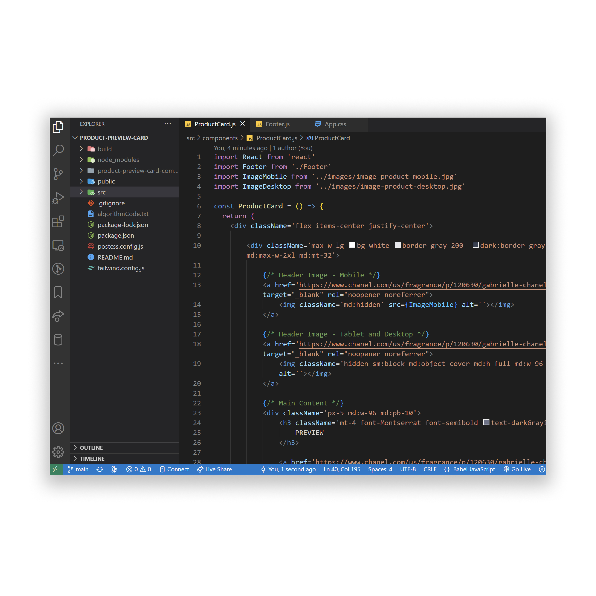

<!-- markdownlint-configure-file {
  "MD013": {
    "code_blocks": false,
    "tables": false
  },
  "MD033": false,
  "MD041": false
} -->

  

# Manage Landing Page Website

This is the Manage Landing Page Website Project Challenge by Frontend Mentor. It
is made with Tailwind CSS Utility Framework and React JS. A Landing Website
Frontend.

Manage Landing Page: John Cañero

Frontend Mentor Challenge - Manage Landing Page

## Website

🖥️ [https://splendorous-cassata-a96886.netlify.app/]

✍️ Project by John Cañero

## Responsive Design

🪟: [Desktop - Tablet - Mobile]

